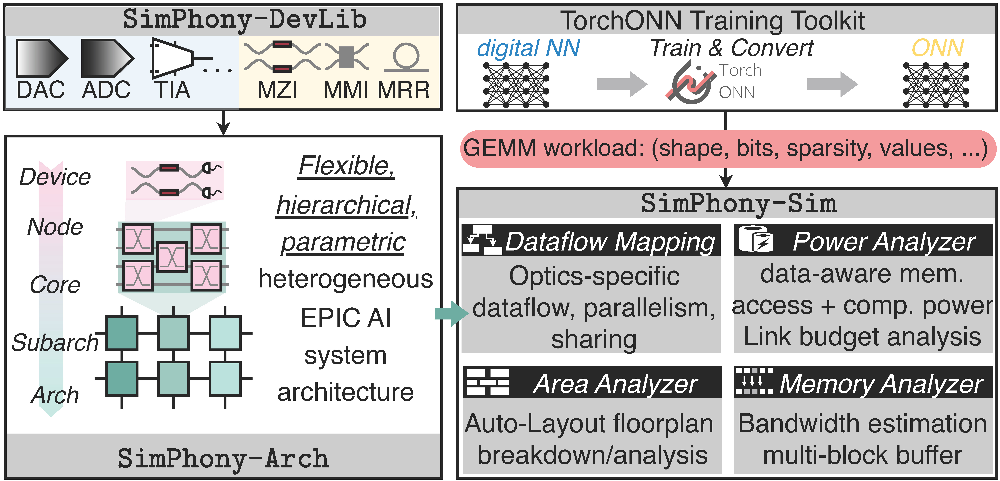
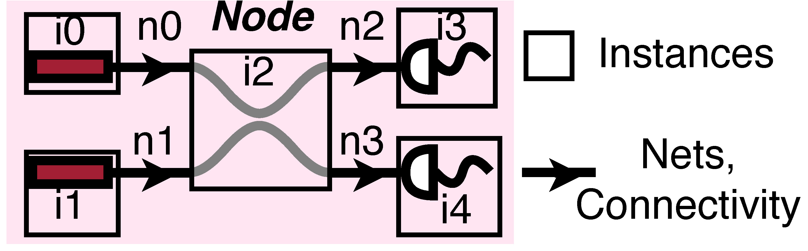
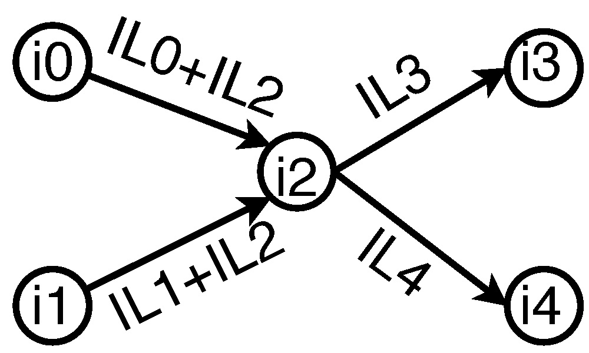
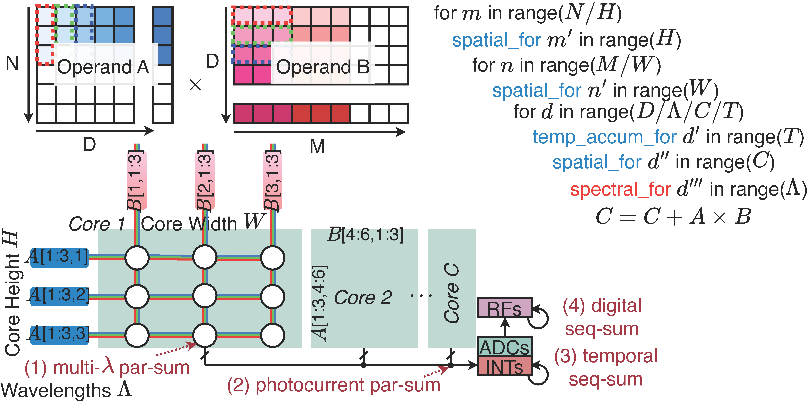
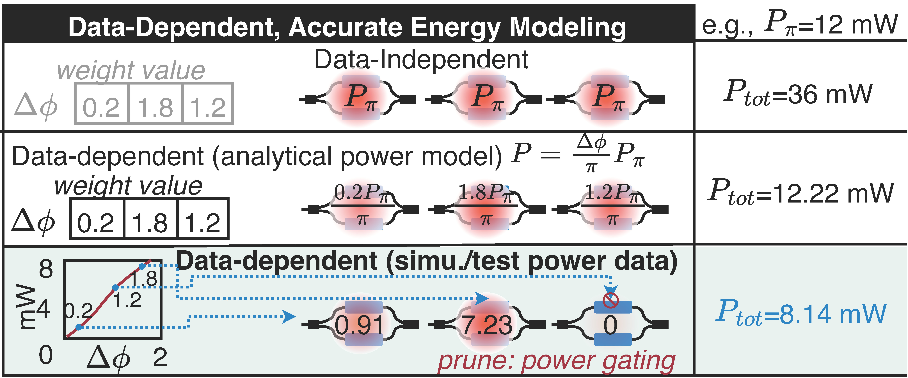
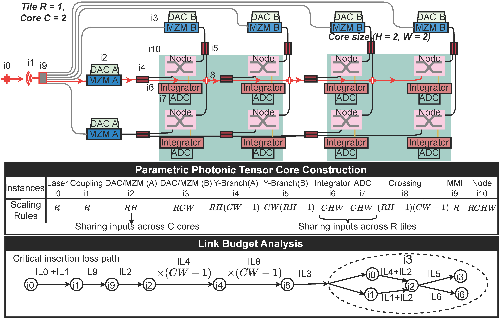
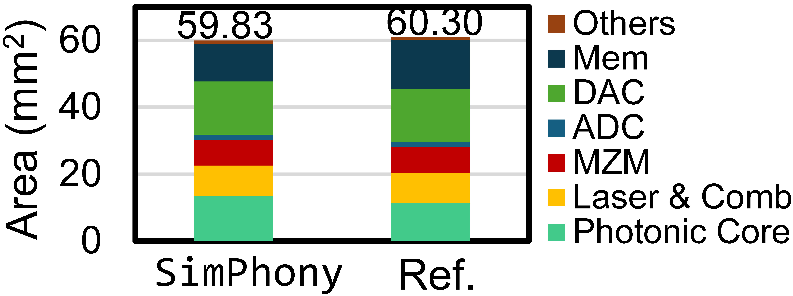
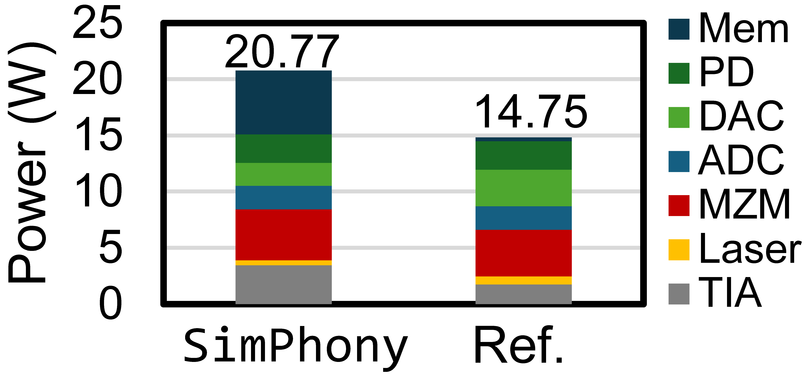

# SimPhony: A Device-Circuit-Architecture Cross-Layer Modeling and Simulation Framework for Heterogeneous Electronic-Photonic AI Systems.

By [Ziang Yin](https://scopex-asu.github.io/index.html), Meng Zhang, Amir Begovic, [Rena Huang](https://faculty.rpi.edu/rena-huang), [Jeff Zhang](https://search.asu.edu/profile/4346755), and [Jiaqi Gu<sup>†</sup>](https://scopex-asu.github.io/index.html).

This repo is the official implementation of ["SimPhony: A Device-Circuit-Architecture Cross-Layer Modeling and Simulation Framework for Heterogeneous Electronic-Photonic AI Systems"](https://arxiv.org/abs/2411.13715)

## Table of Contents

- [Introduction](#introduction)
- [Features](#features)
- [Folder Structure](#folder-structure)
- [Prerequisites](#Prerequisites)
- [Installation](#installation)
- [Usage](#usage)


## Introduction

**SimPhony** aims to provide researchers and engineers with a powerful tool for simulating and analyzing photonic architectures. By supporting various dataflow switching methods and offering extensive device libraries, SimPhony enables detailed performance evaluations and optimizations of photonic systems.

<p align="center">
  

</p>

In **SimPhony**, users can define the basic building blocks and reuse them in photonic core designs. If a complete netlist is provided, **SimPhony** is capable of calculating area in a layout-aware manner. Users can always define a customized function for area calculation.
<p align="center">
  
  
</p>

**SimPhony** realizes photonic domain parallelism during latency and energy calculation; users may define it in the configuration.
<p align="center">
  
</p>

**SimPhony** is also capable of calculating device energy in a data-dependent manner. (Warning: this can only be realized when using both [TorchONN](https://github.com/JeremieMelo/pytorch-onn) and "PowerCalculator" located in ```models/layers/utils```) Users can always define a customized function for any arbitrary energy calculation.
<p align="center">
  
</p>

Case Study: Dynamic Array-style Tensor Cores [TeMPO](https://arxiv.org/html/2402.07393v1).

We first define the architecture parameters: **R** tiles, each containing **C** cores, with **H** $\times$ **W** dot-product nodes per core performing parallel computations. Then, we define the structure of the minimum building block, i.e., the dot-product unit, denoted as a node. A node netlist is used to describe the 6-device circuit topology using directed 2-pin nets to represent the waveguide connections and signal flow. 

To efficiently span the multi-
core architecture without manually detailing every connection, we
define scaling rules applied to each node and describe inter-node
connections. There are **RCHW** total nodes for parallel dot-product. As the output of C cores in a tile are in-situ accumulated, integrators/ADCs can be shared and thus scaled by **CHW** . MZM group A encodes one matrix operand and can be broadcast to R tiles. Thus, the input encoders, i.e., DAC A and MZM A, are scaled by **RH**. 
These scaling rules are expressed as customizable symbolic expressions in circuit description files, enabling user-defined reuse styles to suit specific designs.
<p align="center">
  
</p>

In this folder, we provide [Lightning Transformer](https://arxiv.org/abs/2305.19533), a multi-wavelength version of the [TeMPO](https://arxiv.org/html/2402.07393v1) architecture for users to study and validate. You may run the example in the ```unitest``` folders to learn how each module can be used.

<p align="center">
  
  
</p>

## Features

- **Dataflow Switching**: Supports input, weight, and output stationary dataflows.
- **Device Libraries**:
  - **Photonic Devices**: Includes energy, area, latency, and insertion loss parameters.
  - **Electronic Devices**: Provides detailed models for electronic components.
- **Memory Computation**: Supports bandwidth aware memory hierarchies 
- **Integration with TorchONN**: Seamless integration for optical neural network simulations.
- **Detailed Simulation Report**: Reports from Simphony contain detailed information on each device and each memory hierarchy's energy, and area breakdown. It also provides detailed insertion loss analysis with critical path defined.

## Folder Structure
- **cacti/**: Contains the CACTI tool for cache and memory simulation.
- **configs/**: Configuration files for various simulation aspects.
  - **architecture_mapping/**: Maps architectures for simulation.
  - **design/**: Architecture design-specific configurations.
  - **devices/**: Device parameter configurations.
  - **memory/**: Memory hierarchy configurations.
  - **nn_mapping/**: Neural network mapping configurations.
  - **onn_mapping/**: Optical neural network mapping configurations.
- **models/**: Pre-defined models with customizable layers used in simulations.
- **onnarchsim/**: Core simulation engine and supporting scripts.
  - **database/**: Scripts for recursive architecture and device configuration loading.
  - **plot/**: Scripts for visualizing simulation outputs.
  - **workflow/**: Manages simulation workflows.
  - **simulator.py**: The main simulator script.
  - **version.py**: Version information.
- **unitest/**: Example scripts demonstrating module usage.
- **utils/**: Utilities for configuration loading and management.

## Prerequisites

- Python 3.6 or higher
- Required Python packages (listed in requirements.txt)
- CACTI tool installed in the cacti/ directory
- TorchONN (optional but **highly recommended**, for optical neural network simulations)


Make sure to install the packages mentioned in the requirements.txt.


For Pyutils package, please visit https://github.com/JeremieMelo/pyutility.git and install it manually by typing ```python setup.py --install```

## Installation
```git clone https://github.com/ScopeX-ASU/SimPhony```

## Usage
Please go over each example in the ```unitest``` folder in the following order:

1. ```test_load_devices.py```
2. ```test_architecturedb.py```
3. ```test_CNN_model_convert.py```
4. ```test_insertion_loss.py```
5. ```test_dataflow.py```
6. ```test_energy.py```
7. ```test_area.py```
8. ```test_memory.py```
9. ```test_sim.py```


# Citing SCATTER
```
@misc{yin2024simphonydevicecircuitarchitecturecrosslayermodeling,
      title={SimPhony: A Device-Circuit-Architecture Cross-Layer Modeling and Simulation Framework for Heterogeneous Electronic-Photonic AI System}, 
      author={Ziang Yin and Meng Zhang and Amir Begovic and Rena Huang and Jeff Zhang and Jiaqi Gu},
      year={2024},
      eprint={2411.13715},
      archivePrefix={arXiv},
      primaryClass={physics.optics},
      url={https://arxiv.org/abs/2411.13715}, 
}
```
